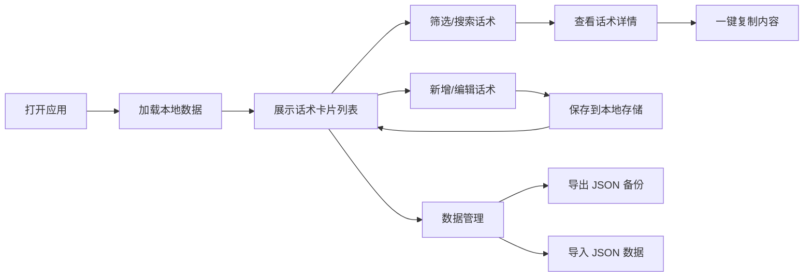

## 1. 产品概述

WorkSnippetHub 是一款纯前端的工作常用话术与资料管理工具，帮助用户高效保存、分类、搜索和一键复制工作中频繁使用的文字、图片、链接和说明内容。

- 目标用户：需要频繁回复客户、撰写汇报、处理标准化流程的职场人士
- 核心价值：减少重复输入，提高工作效率，本地数据安全私密
- 部署方式：纯前端静态页面，可部署于 GitHub Pages 等静态托管平台

## 2. 核心功能

### 2.1 用户角色

| 角色 | 注册方式 | 核心权限 |
|------|----------|----------|
| 普通用户 | 无需注册，本地使用 | 全部功能，数据存储在本地浏览器 |

### 2.2 功能模块

1. **话术管理**：话术卡片列表、新增/编辑/删除话术、分类归属、标签标记
2. **分类管理**：分类树/列表、新增/编辑/删除分类、分类排序
3. **搜索筛选**：关键词搜索、分类筛选、标签筛选
4. **一键复制**：点击复制文本内容、复制提示反馈
5. **图片资料**：图片上传、预览、图片说明文字
6. **数据管理**：JSON 导入导出、数据清空、本地存储
7. **设置与关于**：主题切换、使用说明、版本信息

### 2.3 页面详情

| 页面名称 | 模块名称 | 功能描述 |
|----------|----------|----------|
| 主页面 | 顶部导航栏 | Logo、搜索框、新增按钮、设置菜单 |
| 主页面 | 左侧分类栏 | 分类树列表、全部话术、未分类、分类管理入口 |
| 主页面 | 内容展示区 | 话术卡片网格/列表视图、分类标题、空状态提示 |
| 主页面 | 右侧详情面板 | 话术详情、复制按钮、编辑/删除操作 |
| 编辑弹窗 | 话术编辑 | 标题、内容、分类选择、标签输入、图片上传 |
| 分类管理 | 分类列表 | 分类名称、颜色标识、新增/编辑/删除/排序 |
| 数据管理 | 导入导出 | JSON 文件导入、数据导出下载、数据清空确认 |
| 设置面板 | 偏好设置 | 主题切换、视图模式切换、关于信息 |

## 3. 核心流程

用户打开应用后，可直接浏览已有话术卡片，通过左侧分类筛选或顶部搜索快速定位内容。点击卡片可查看详情并一键复制。需要新增时，点击新增按钮填写标题、内容、分类和标签后保存。所有数据自动保存到本地浏览器，支持随时导出备份或导入恢复。

## 4. 用户界面设计

### 4.1 设计风格

- **主色调**：深邃靛蓝（#1e3a5f）搭配暖金点缀（#d4a853），营造专业高效的职场氛围
- **辅助色**：柔和灰蓝背景，卡片白色底配细边框，层次分明
- **按钮风格**：圆角 6px，主按钮深邃靛蓝填充，悬停微亮，过渡流畅
- **字体**：标题使用思源宋体 / Noto Serif SC 增加稳重感，正文使用系统无衬线字体保证可读性
- **布局风格**：三栏式布局（左分类 + 中卡片 + 右详情），顶部固定导航栏
- **图标风格**：线性简洁图标，统一 24px 网格，与 Element Plus 图标风格一致

### 4.2 页面设计概览

| 页面名称 | 模块名称 | UI 元素 |
|----------|----------|---------|
| 主页面 | 顶部导航栏 | 深色背景、Logo 文字标识、圆角搜索框、主色新增按钮、设置图标 |
| 主页面 | 左侧分类栏 | 浅灰背景、分类列表项、选中项主色高亮、分类计数角标 |
| 主页面 | 内容展示区 | 卡片网格布局、卡片悬浮阴影、标签胶囊、复制按钮、入场渐入动画 |
| 主页面 | 右侧详情面板 | 滑入动画、标题区、内容区 Markdown 渲染、操作按钮组 |
| 编辑弹窗 | 表单区域 | 分组字段、标签输入、图片上传拖拽区、保存取消按钮 |
| 分类管理 | 分类列表 | 颜色圆点、拖拽排序、编辑删除内联操作 |

### 4.3 响应式

- 桌面端优先（1280px+）：三栏完整布局
- 平板端（768-1279px）：隐藏右侧详情面板，改为弹窗展示
- 移动端（<768px）：左右栏收起为抽屉，卡片单列布局，底部导航

### 4.4 动画与交互

- 页面加载：分类栏和卡片区交错渐入（staggered fade-in）
- 卡片悬浮：上移 2px + 阴影加深 + 边框微亮
- 复制反馈：按钮文字变为"已复制 ✓"，2 秒后恢复，伴随轻微缩放动效
- 侧边栏切换：平滑宽度过渡 + 内容区自适应
- 弹窗出现：背景模糊 + 弹窗缩放淡入
