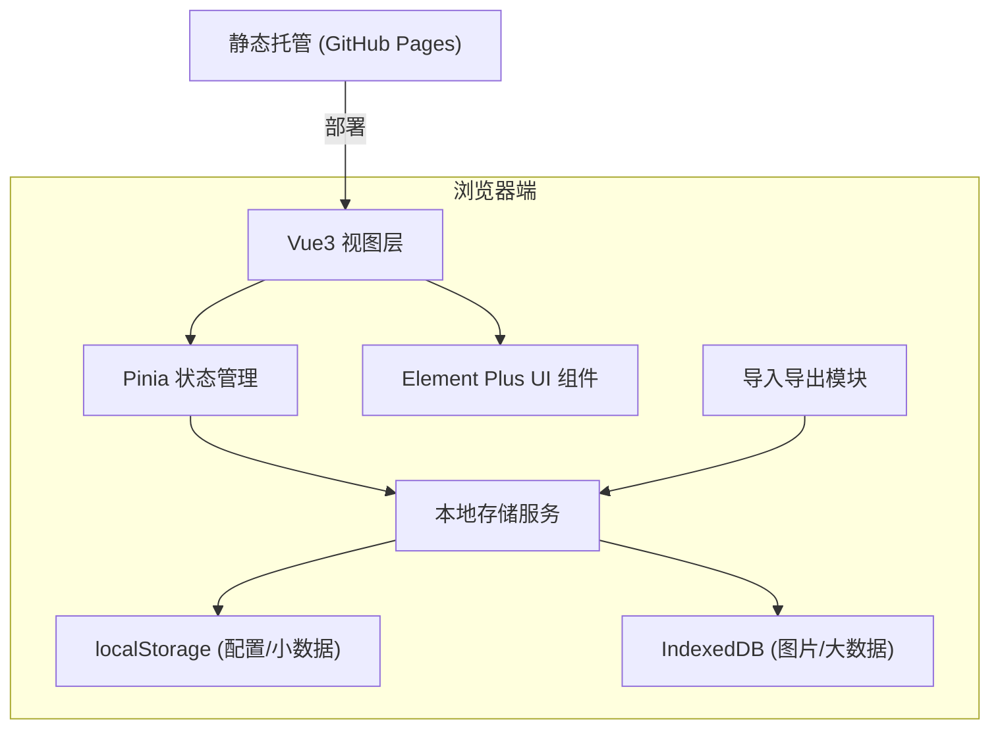
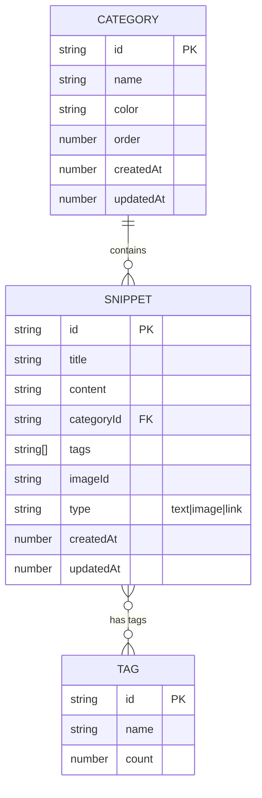

## 1. 架构设计

纯前端单页应用，所有数据存储在浏览器本地，无需后端服务。



## 2. 技术描述

- **前端框架**：Vue@3 + Vite@5 + TypeScript
- **UI 组件库**：Element Plus
- **状态管理**：Pinia
- **路由**：Vue Router（单页多视图，可选 hash 模式适配 GitHub Pages）
- **本地存储**：localStorage + IndexedDB（图片大对象存储）
- **构建工具**：Vite
- **部署**：GitHub Pages 静态部署

## 3. 目录结构

```
src/
├── components/       # 可复用组件
│   ├── SnippetCard.vue
│   ├── CategorySidebar.vue
│   ├── SnippetDetail.vue
│   ├── SnippetEditor.vue
│   ├── SearchBar.vue
│   └── TagInput.vue
├── stores/           # Pinia 状态
│   ├── snippets.ts
│   ├── categories.ts
│   └── settings.ts
├── utils/            # 工具函数
│   ├── storage.ts    # localStorage 封装
│   ├── idb.ts        # IndexedDB 封装
│   ├── clipboard.ts  # 复制功能
│   └── export.ts     # 导入导出
├── types/            # TypeScript 类型
│   └── index.ts
├── views/            # 页面视图
│   └── Home.vue
├── App.vue
└── main.ts
```

## 4. 路由定义

| 路由 | 用途 |
|------|------|
| / | 主页面，展示话术列表和分类 |

单页应用，主要通过组件切换和弹窗实现功能导航。

## 5. 数据模型

### 5.1 数据模型定义



### 5.2 数据说明

- **Snippet（话术/资料）**：核心实体，包含标题、内容、分类、标签、类型等
- **Category（分类）**：一级分类结构，支持颜色标识和排序
- **Tag（标签）**：多对多关系，用于灵活筛选
- **图片**：大尺寸图片存入 IndexedDB，小图可直接 base64 存入 snippet

### 5.3 本地存储方案

- **localStorage**：存储配置、分类、话术元数据（不含图片内容），key: `workshub_data`
- **IndexedDB**：存储图片文件 Blob，按 snippetId 关联
- **导入导出格式**：JSON，包含 categories、snippets、tags 全量数据，图片转 base64 内嵌

## 6. 核心模块说明

### 6.1 话术管理模块
- 增删改查 CRUD 操作
- 按分类/标签/关键词筛选
- 按创建时间/更新时间/标题排序

### 6.2 复制功能
- 使用 navigator.clipboard API
- 降级方案：创建 textarea + execCommand
- 复制成功的视觉反馈

### 6.3 图片管理
- 拖拽或点击上传图片
- 预览大图功能
- IndexedDB 存储原始文件
- 导出时转 base64 内嵌到 JSON

### 6.4 数据导入导出
- 导出：全量数据序列化为 JSON 并下载
- 导入：解析 JSON 文件，校验格式，合并或覆盖数据
- 导入前确认弹窗，导入后提示结果

### 6.5 搜索功能
- 标题和内容全文模糊匹配
- 支持多关键词（空格分隔）
- 标签精准匹配
- 实时搜索（输入防抖 300ms）
